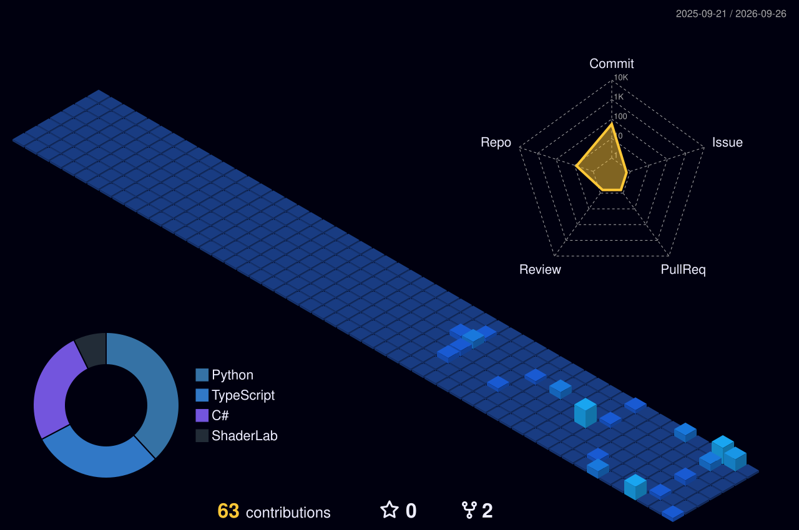

  

    

  > *"Mankind was born on Earth. It was never meant to die here."* 

---

### 🌌 Overview

I am an **AI & ML Engineering student** focused on **computational astrophysics**, **real-time 3D physics engines**, and **autonomous agents**. My work bridges fundamental physics equations with interactive 3D simulations in **Unity (C#)**, **Python**, and **Blender**.

---

### 🔬 Core Disciplines

- **🪐 Astrophysics & Celestial Mechanics:** N-body gravitational simulations, General Relativity spacetime curvature distortion, and Keplerian orbital collision tracking.
- **🤖 Autonomous AI & Digital Twins:** Reinforcement Learning (PPO) via Unity ML-Agents, transient thermal ODE modeling, and sensor-driven decision systems.
- **🎮 Real-Time Graphics Engine Dev:** Custom URP shaders, frame-rate independent physics loops, and 3D asset pipeline architecture.

---

### 🛠️ Tech Stack & Tooling

#### 🪐 Physics Engines & 3D Simulation

  
  
  
  
  

#### 🧠 Artificial Intelligence & Deep Learning

  
  
  
  
  
  
  

#### 💻 Programming Languages & Systems

  
  
  
  
  
  

#### 🌐 Full-Stack & Developer Ecosystem

  
  
  
  
  
  

---

### 🔭 Selected Works & Projects

<!--START_SECTION:projects-->
- 🧊 **[Ksheera-Raksha](https://github.com/ANIL6190/Ksheera-Raksha)** &nbsp;`ShaderLab` `MATLAB` `Digital Twin` `Thermal Physics`
  > Low-cost 5-layer PCM & polyurethane insulated milk chilling digital twin. Combines MATLAB transient thermal ODE physics simulation with a real-time Unity URP 3D heat-map visualization for small-scale dairy farmers.

- 🪐 **[3-Body-Problem-Simulation](https://github.com/ANIL6190/3-Body-Problem-Simulation)** &nbsp;`Unity URP` `C#` `Astrophysics` `Physics Engine`
  > 3D N-body gravitational simulation in Unity URP featuring General Relativity spacetime fabric distortion, Plummer potential gravity wells, Velocity Verlet physics, real astronomical scaling, and interactive multi-target orbit cameras.

- 📡 **[AEGIS-TOWER](https://github.com/ANIL6190/AEGIS-TOWER)** &nbsp;`Keplerian Mechanics` `Python` `AI/ML` `CelesTrak`
  > Real-time AI-powered satellite collision risk monitoring system — tracks orbital conjunctions using Keplerian propagation + ML models trained on CelesTrak SOCRATES data, with a live 3D tactical operations dashboard.

- 🏠 **[GharPayy-A-Smart-PG-Booking-Platform](https://github.com/ANIL6190/GharPayy-A-Smart-PG-Booking-Platform)** &nbsp;`Next.js` `TypeScript` `Full-Stack Web`
  > GharPayy is a web-based platform designed to simplify the process of finding and booking Paying Guest (PG) accommodations. It provides a centralized system where users can search, compare, and book PGs, while property owners can manage listings and bookings efficiently.

- 🏎️ **[SlefDrivingCar_simulation](https://github.com/ANIL6190/SlefDrivingCar_simulation)** &nbsp;`Unity` `ML-Agents (PPO)` `Autonomous AI` `C#`
  > Autonomous driving agent simulation in Unity using ML-Agents (PPO) with raycast distance sensors and checkpoint-based reward tracking.

- 🔍 **[Lost-and-Found-System](https://github.com/ANIL6190/Lost-and-Found-System)** &nbsp;`Next.js` `TypeScript` `Graph / Trie Algorithms`
  > Smart Lost & Found platform utilizing BFS graphs for proximity matching, Trie prefix tree autocomplete, MaxHeap priority queues, and LinkedList log feeds. Built with Next.js, TypeScript
<!--END_SECTION:projects-->

---

### 🏙️ 3D Contribution Skyline

  <picture>
    <source media="(prefers-color-scheme: dark)" srcset="profile-3d-contrib/profile-night-view.svg">
    <source media="(prefers-color-scheme: light)" srcset="profile-3d-contrib/profile-night-view.svg">
    
  </picture>

---

### 📊 System Telemetry

  
  

  
  

---

### ⚡ Recent Activity
<!--START_SECTION:activity-->
- 🔨 Pushed **1 commit** to [`ANIL6190`](https://github.com/ANIL6190/ANIL6190) • `1d ago`
- 🌱 Created branch `main` in [`ANIL6190`](https://github.com/ANIL6190/ANIL6190) • `1d ago`
- 🔨 Pushed **1 commit** to [`Ksheera-Raksha`](https://github.com/ANIL6190/Ksheera-Raksha) • `1d ago`
- 🌱 Created branch `main` in [`Ksheera-Raksha`](https://github.com/ANIL6190/Ksheera-Raksha) • `1d ago`
- ⭐ Starred [`ANIL6190`](https://github.com/ANIL6190/ANIL6190) • `1d ago`
- 🔨 Pushed **1 commit** to [`3-Body-Problem-Simulation`](https://github.com/ANIL6190/3-Body-Problem-Simulation) • `Aug 16, 2026`
<!--END_SECTION:activity-->
